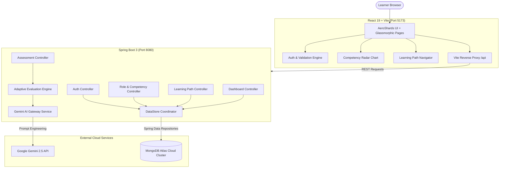

# AdaptIQ — AI-Powered Adaptive Competency Platform

[](https://spring.io/projects/spring-boot)
[](https://react.dev/)
[](https://www.mongodb.com/atlas)
[](https://ai.google.dev/)
[](https://vitejs.dev/)
[](LICENSE)

> **AdaptIQ** is an enterprise-grade adaptive learning ecosystem that eliminates static, one-size-fits-all curricula. Powered by **Google Gemini AI**, **Spring Boot 3**, and **MongoDB Atlas**, AdaptIQ diagnoses an engineer's competency gaps through role-targeted diagnostic assessments and dynamically synthesizes personalized, level-aware learning roadmaps in real-time.

---

## 🌟 Key Features

### 🎯 10 Targeted Engineering Career Tracks
Pre-configured with industry-standard competency graphs, technical benchmarks, and evaluation criteria:
- **Full Stack Cloud Developer**
- **Frontend Architect**
- **Backend Engineer**
- **AI & Prompt Systems Engineer**
- **Java Developer**
- **DevOps Engineer**
- **Data Engineer**
- **QA Automation Engineer**
- **Security Engineer**
- **Product Engineer**

### 🧠 Adaptive AI Diagnostic Engine
- **Generative Diagnostic Quizzes**: Role-specific assessment questions generated dynamically via Google Gemini.
- **Competency Matrix Scoring**: Quantifies proficiency across individual technical benchmarks rather than simple pass/fail metrics.
- **Skill Classification**: Accurately classifies competency into **Novice**, **Intermediate**, or **Expert** tiers.
- **Detailed Explanations & Review**: Provides instant feedback, model answers, code breakdowns, and remediation notes for every question.

### 🗺️ Dynamic Persona-Aware Learning Paths
- **Tailored Curricula**: Generates ordered module pathways targeting diagnosed skill deficiencies.
- **Multi-Role Profiling**: Allows users to assess across multiple careers; independent learning graphs are preserved per role.
- **Level-Aware Synthesized Lessons**:
  - **Novice Tier**: Mental models, fundamental syntax, interactive analogies, and step-by-step walkthroughs.
  - **Intermediate Tier**: Real-world architecture, error debugging, state orchestration, and performance tradeoffs.
  - **Expert Tier**: High-throughput distributed patterns, memory profiling, production resilience, and enterprise security.

### 🏆 Interactive Skill Checkpoints
- Real-time diagnostic promotion challenges.
- Score 80%+ on targeted technical challenges to dynamically advance competencies and update radar charts.

### 💎 Next-Generation Visual Experience
- **AeroShards 3D Background**: GPU-accelerated interactive floating gem shards with physics-based repel dynamics.
- **Glassmorphic Theme**: Deep-space dark canvas (`#120F17`), neon violet/purple accents (`#A855F7`), and frosted glass panels.
- **Instant Client-Side Form Validation**: Real-time email RFC validation, password strength meters, error badges, and toggle visibility.
- **Smart 404 Route Protection**: Detects unrecognized URL paths and provides route recovery suggestions.

### 🍃 Resilient MongoDB Atlas Persistence
- Automated synchronization with cloud MongoDB Atlas clusters (`spring-boot-starter-data-mongodb`).
- Write-through persistence on all mutations (Users, Roles, Modules, Assessments, Results, Progress Records).
- Resilient local fallback to ensure continuous uptime during network partitions.

---

## 🏗️ Architecture Overview



---

## 🛠️ Technology Stack

| Layer | Technologies |
|---|---|
| **Frontend** | React 19, Vite, Lucide React, Canvas Confetti, VGPU Shaders, Vanilla CSS |
| **Backend** | Java 17+, Spring Boot 3.2.5, Spring MVC, Spring Web |
| **Database** | MongoDB Atlas Cloud, Spring Data MongoDB (`spring-boot-starter-data-mongodb`) |
| **Artificial Intelligence** | Google Gemini API (`gemini-2.5-flash` / `gemini-1.5-pro`) |
| **Build & Tooling** | Maven Wrapper (`mvnw`), Node.js / npm, PowerShell / Bash |

---

## 📂 Project Structure

```text
AdaptIQ/
├── backend/
│   ├── pom.xml                                   # Spring Boot dependencies & Maven build
│   ├── src/main/java/com/adaptivelearning/
│   │   ├── AdaptiveLearningApplication.java      # Application bootstrap entry point
│   │   ├── config/
│   │   │   └── WebConfig.java                    # Global CORS & reverse proxy filter
│   │   ├── controller/                           # REST API Controllers
│   │   │   ├── AuthController.java               # Register, login, session verify
│   │   │   ├── RoleController.java               # Roles & competencies catalog
│   │   │   ├── AssessmentController.java         # AI Quiz generation & submission
│   │   │   ├── LearningPathController.java       # Adaptive roadmap synthesis
│   │   │   ├── ModuleController.java             # Module reader & completion
│   │   │   ├── DashboardController.java          # Analytics, radar, streak logs
│   │   │   ├── SystemController.java             # Health & AI metadata
│   │   │   └── GlobalExceptionHandler.java       # 404 & route error handling
│   │   ├── model/                                # MongoDB Document Entities (@Document, @Id)
│   │   │   ├── User.java                         # User entity & credentials
│   │   │   ├── Role.java                         # Engineering career tracks
│   │   │   ├── Competency.java                   # Skills & benchmarks
│   │   │   ├── LearningPath.java                 # Personalized roadmaps
│   │   │   ├── LearningModule.java               # Modular lessons
│   │   │   ├── Quiz.java                         # Assessment questions & options
│   │   │   ├── QuizResult.java                   # User scores & answer history
│   │   │   └── ProgressRecord.java               # Historical progress timeline
│   │   ├── repository/                           # Spring Data MongoDB Repositories
│   │   │   ├── UserRepository.java
│   │   │   ├── RoleRepository.java
│   │   │   ├── CompetencyRepository.java
│   │   │   ├── LearningPathRepository.java
│   │   │   ├── ModuleRepository.java
│   │   │   ├── QuizRepository.java
│   │   │   ├── QuizResultRepository.java
│   │   │   ├── ProgressRecordRepository.java
│   │   │   └── DataStore.java                    # Persistence & caching coordinator
│   │   └── service/                              # Core Domain Services
│   │       ├── GeminiService.java                # Google Gemini API integration
│   │       ├── AssessmentService.java            # Diagnostic scoring & checkpoints
│   │       ├── LearningPathService.java          # Adaptive path generation
│   │       └── ContentSynthesisService.java      # Level-aware content synthesis
│   └── src/main/resources/
│       └── application.properties                # MongoDB Atlas URI & AI configs
│
├── frontend/
│   ├── index.html                                # Web app entry & fonts
│   ├── vite.config.js                            # Vite proxy configuration
│   ├── package.json                              # UI dependencies & scripts
│   └── src/
│       ├── App.jsx                               # Master app router & state coordinator
│       ├── main.jsx                              # React DOM mount point
│       ├── index.css                             # Global design system & tokens
│       ├── api.js                                # Frontend API client
│       ├── components/
│       │   ├── AeroShards.jsx                    # 3D interactive gem shader background
│       │   ├── AeroShards.css                    # WebGL canvas styling
│       │   ├── Navbar.jsx                        # Glassmorphic top navigation bar
│       │   ├── CheckpointModal.jsx               # Skill promotion challenge modal
│       │   └── NotFound.jsx                      # 404 error page with smart suggestions
│       └── pages/
│           ├── Login.jsx                         # Auth portal with live validations
│           ├── RoleSelection.jsx                 # Career path explorer & selection
│           ├── QuizView.jsx                      # Diagnostic test interface
│           ├── AssessmentResult.jsx              # Score breakdowns & radar chart
│           ├── LearningPath.jsx                  # Visual roadmap & module milestones
│           ├── ModuleViewer.jsx                  # Interactive lesson reader & quizzes
│           └── Dashboard.jsx                     # Progress analytics, streak & stats
└── README.md
```

---

## 🗄️ MongoDB Database Schema

The application persists data into the **`adaptiq`** database across 8 collections:

| Collection | Description | Primary Key | Key Attributes |
|---|---|---|---|
| `users` | User credentials & profiles | `id` (String) | `email`, `password`, `displayName`, `roleId`, `overallLevel` |
| `roles` | Engineering tracks | `id` (String) | `name`, `category`, `description`, `competencies` |
| `competencies` | Technical benchmarks | `id` (String) | `name`, `category`, `description`, `benchmarks` |
| `learning_paths` | Generated curricula | `id` (String) | `userId`, `roleId`, `moduleIds`, `completedModuleIds` |
| `modules` | Lesson content | `id` (String) | `title`, `competencyId`, `targetLevel`, `content`, `sections` |
| `quizzes` | Diagnostic assessments | `id` (String) | `roleId`, `userId`, `questions`, `difficulty` |
| `quiz_results` | Submissions & metrics | `id` (String) | `userId`, `quizId`, `score`, `competencyScores` |
| `progress_records` | Activity milestones | `id` (String) | `userId`, `moduleId`, `timestamp`, `scoreEarned` |

---

## 🚀 Quickstart & Setup

### Prerequisites
- **Node.js**: v20.19+ or v22.12+
- **Java Development Kit (JDK)**: 17 or higher
- **Maven**: 3.8+ (or use the included `./mvnw` wrapper)
- **MongoDB Atlas Account**: Cloud cluster or local MongoDB instance

---

### 1. Clone the Repository
```bash
git clone https://github.com/kirankumarmaddukuri/AdaptIQ.git
cd AdaptIQ
```

---

### 2. Configure Backend
Open `backend/src/main/resources/application.properties` and verify your MongoDB Atlas and Gemini AI configurations:

```properties
# MongoDB Atlas Configuration
spring.data.mongodb.uri=${MONGODB_URI:mongodb+srv://<username>:<password>@<cluster-host>/adaptiq?retryWrites=true&w=majority&appName=Cluster0}
spring.data.mongodb.auto-index-creation=true

# Server Port
server.port=8080

# Google Gemini AI Configuration
gemini.api.key=${GEMINI_API_KEY:your_gemini_api_key_here}
gemini.model=${GEMINI_MODEL:gemini-2.5-flash}
```

> **Note**: You can also supply `MONGODB_URI` and `GEMINI_API_KEY` via environment variables without modifying source files.

---

### 3. Start the Backend Server
Open a terminal in the `backend/` directory:

```powershell
# Windows
.\mvnw spring-boot:run

# Linux / macOS
./mvnw spring-boot:run
```
The Spring Boot backend will start on: **`http://localhost:8080`**

---

### 4. Start the Frontend Application
Open a second terminal in the `frontend/` directory:

```bash
cd frontend
npm install
npm run dev
```
The Vite development server will start on: **`http://localhost:5173`**

---

## 📡 REST API Reference

| HTTP Method | Endpoint | Description |
|---|---|---|
| `POST` | `/api/auth/register` | Register a new user profile with selected target career track |
| `POST` | `/api/auth/login` | Authenticate existing user with email and password |
| `POST` | `/api/auth/verify` | Verify current session / token |
| `GET` | `/api/roles` | Retrieve all 10 available engineering career roles |
| `GET` | `/api/roles/{roleId}` | Retrieve role details and associated competencies |
| `POST` | `/api/assessment/generate` | Generate dynamic role-targeted diagnostic questions |
| `POST` | `/api/assessment/submit` | Submit diagnostic answers and compute competency scores |
| `GET` | `/api/assessment/result/{quizId}` | Retrieve previous assessment breakdown and explanations |
| `POST` | `/api/learning-path/generate` | Synthesize an adaptive learning roadmap based on assessment results |
| `GET` | `/api/learning-path/{userId}` | Retrieve the active learning path for the specified user |
| `GET` | `/api/modules/{moduleId}` | Fetch synthesized lesson content and exercises for a module |
| `POST` | `/api/modules/{moduleId}/complete` | Mark a module as completed and update progress |
| `POST` | `/api/checkpoint/generate` | Generate a targeted skill promotion challenge |
| `POST` | `/api/checkpoint/submit` | Submit checkpoint results to promote competency level |
| `GET` | `/api/dashboard/{userId}` | Retrieve full dashboard data (radar metrics, streaks, history) |
| `GET` | `/api/system/info` | Fetch backend health, version, and active AI model name |

---

## 🧪 Verification & Testing

### Backend Unit & Integration Tests
```powershell
cd backend
.\mvnw test
```

### Frontend Production Build Check
```bash
cd frontend
npm run build
```

---

## 👥 Authors & Acknowledgments

- **Lead Developer**: Kiran Kumar Maddukuri ([@kirankumarmaddukuri](https://github.com/kirankumarmaddukuri))
- **UI Aesthetics**: Inspired by [ReactBits AeroShards](https://reactbits.dev/backgrounds/aero-shards)
- **AI Infrastructure**: Powered by [Google Gemini](https://ai.google.dev/)
- **Database**: Cloud persistence managed by [MongoDB Atlas](https://www.mongodb.com/atlas)
